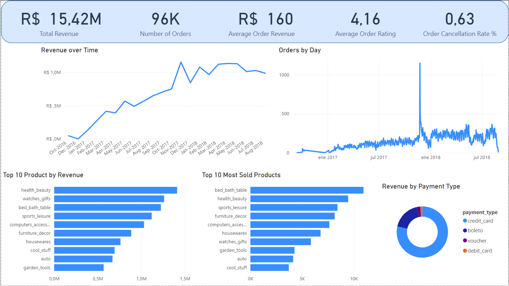

# Olist Dataset – Data Analysis & Business Insights

This project analyzes real commercial data from the Olist Store, an online retail operation that sells across multiple marketplaces in Brazil. Utilizing **SQL** and **Power BI**, the goal is to perform thorough **data cleaning**, **exploratory analysis**, and answer **key business questions** to uncover insights related to revenue, customer behavior, product performance, and seller dynamics. 

---

## Table of Contents

1. [Data Source](#1-data-source)  
2. [Data Exploration](#2-data-exploration)  
3. [Data Cleaning](#3-data-cleaning)  
4. [Business Questions and Insights](#4-business-questions-and-insights)  
5. [Power BI Dashboard](#5-power-bi-dashboard)  

---

## 1. Data Source

The dataset used in this project is publicly available on Kaggle:
<a href="https://www.kaggle.com/datasets/olistbr/brazilian-ecommerce" target="_blank"><strong>Brazilian E-Commerce Public Dataset by Olist</strong></a>  

---

## 2. Data Exploration

### Customers
- There are returning customers who made more than one purchase through Olist.
- 39 customers are registered in more than one state.
- Top 5 states with the most customers:  
  São Paulo, Rio de Janeiro, Minas Gerais, Rio Grande do Sul, Paraná

### Order Items
- Approximately 90% of orders contain only one item.

### Reviews
- 789 reviews were reused in more than one order and 547 orders received multiple reviews. This indicates both review reuse and multiple submissions per order.

### Orders
- 97% of orders were delivered (96,478).
- 1.2% were cancelled or marked unavailable (1,234).
- Negative time values identified in:
  - Preparation time (from approval to carrier): 1,349 cases
  - Shipping time (from carrier to customer): 23 cases
- Incomplete delivery records:
  - 14 orders missing approved timestamp
  - 2 missing carrier delivery timestamp
  - 8 missing customer delivery timestamp
- Geographic preparation time issues:
  - São Paulo, Minas Gerais, Paraná are not the most error-prone by rate, but do drive the majority of issues simply because of volume.
  - Maranhão has the highest preparation time issue rate: 4.9%

### Products
- 1 completely empty row (all columns NULL).
- 610 products are missing a category: they are not associated with any known product category in the translation table.

### Sellers
- Top 5 seller states: São Paulo, Paraná, Minas Gerais, Santa Catarina, Rio de Janeiro

### Translation Table
- 622 product categories without English translations:
  - `pc_gamer` (3)
  - `portateis_cozinha_e_preparadores_de_alimentos` (10)
  - `Unlisted / Missing` (609)

---

## 3. Data Cleaning

### Reviews Table
- Created a cleaned version:
  - One review per order
  - Kept the most recent review if duplicates existed

### Products Table
- Removed 1 fully empty row
- Replaced NULLs:
  - Product category: set to `'unknown'`
  - Name, description, and photo length: set to 0
- Imputed missing physical dimensions for known products
- Added English category

### Translation Table
- Create a new table with the 3 missing categories

---

4. ## Business Questions and Insights

Below are the 15 key business questions that guided the analysis, along with insights derived from the data.

**Q1: What is the total revenue generated by Olist, and how has it changed over time?**  
Olist generated a total revenue of **R$15,421,083**. Revenue has shown a consistent upward trend over time, with growth in every quarter except Q3 2018, which includes only July and August. The best-performing quarter was Q2 2018, and the highest-revenue month was November 2017.

**Q2: How many orders were placed on Olist, and how does this vary by month or season?**  
A total of **96,470 orders** were placed. Order volume steadily increased over time, with peaks during:
- Best Season: Fall 2018 (March–May)
- Best Quarter: Q1 2018
- Best Month: November 2017
- Best Day: Black Friday, November 24, 2017

**Q3: How accurately are orders delivered compared to their estimated delivery dates?**  
Almost **92% of orders are not delivered on the estimated date**. The vast majority are delivered late, highlighting a 
key opportunity to improve logistics and customer satisfaction.

**Q4: What are the most popular product categories on Olist, and how do their sales volumes compare to each other?**  
The top 5 categories by sales volume are:
1. Bed Bath Table  
2. Health Beauty  
3. Sports Leisure  
4. Furniture Decor  
5. Computers Accessories 

**Q5: What are the top-selling products on Olist, and how have their sales trends changed over time?**  
Top 3 categories by revenue overall are:
1. Health Beauty  
2. Watches Gifts  
3. Bed Bath Table 

Trends by year:
- **2016**: Furniture Decor, Perfumery, Toys  
- **2017**: Bed Bath Table, Health Beauty, Sports Leisure  
- **2018**: Health Beauty, Watches Gifts, Bed Bath Table 

Product category trends shift each year, highlighting the importance of timely category-level demand analysis.

**Q6: What is the average order value (AOV) on Olist, and how does this vary by product category or payment method?**  
Overall AOV: **R$160**. The top categories by AOV are:
- Computers
- Small Appliances (Oven & Coffee)
- Home Appliances (2)
- Agro Industry & Commerce
- Musical Instruments 

By payment method, credit card purchases had the highest AOV (R$163), while boleto had the lowest (R$93).

**Q7: How many sellers are active on Olist, and how does this number change over time?**  
There are **1,898 active sellers**, defined as those making at least one sale within 30 days of a previous one. 
Seller activity increased notably from April 2018, peaking in August 2018.

**Q8: What is the distribution of seller ratings on Olist, and how does this impact sales performance?**  
Seller average ratings:
- 56.7% = 4 stars  
- 19.2% = 3 stars  
- 19.1% = 5 stars  
- 4.9% = below 3 stars 

In terms of revenue:
- 58% comes from 5-star orders
- 19.1% from 4-star
- 11.8% from 1-star
- 7.8% from 3-star
- 3.2% from 2-star

Interestingly, 1-star orders have the highest average revenue per order, suggesting high expectations or post-sale dissatisfaction despite strong initial purchase value.

**Q9: How many customers have made repeat purchases on Olist, and what percentage of total sales do they account for?**  
Only **2,801 customers** made more than one purchase, contributing to **5.61% of total revenue**. This shows **low customer retention**.

**Q10: What is the average customer rating for products sold on Olist, and how does this impact sales performance?**  
The average customer rating is **4.0**. High-revenue categories such as Health Beauty, Watches Gifts, and Bed Bath Table maintain this average rating, showing consistent satisfaction.

**Q11: What is the average and monthly trend of 5-star review rates?**  
On average, **60.32% of reviews** are 5-star. This percentage remains **stable over time**.

**Q12: What is the average order cancellation rate on Olist, and how does this impact seller performance?**  
The order cancellation rate is low at **0.63%**, well within acceptable industry standards (e.g., Amazon’s target is under 2.5%). 
This indicates strong seller compliance and a healthy order fulfillment process.

**Q13: Which payment methods are most commonly used by Olist customers, and how does this vary by product category or geographic region?**  
**Credit cards** dominate:
- Used in **74% of orders**
- Represent **78.5% of total revenue**
They are especially:
- Preferred in major states like São Paulo, Rio de Janeiro, and Minas Gerais.
- Commonly used for top-selling categories such as Bed Bath Table, Health Beauty, Sports Leisure, Furniture Decoration, and Computer Accessories

**Q14: How accurately do item prices and freight values reflect the actual payment amounts received from customers, and what is the average discrepancy?**  
Expected revenue: **R$ 15,418,251.37**  
Actual revenue: **R$ 15,421,082.85**  
Discrepancy: **R $2,831.48** (just 0.02%)  
This shows **almost perfect alignment**.

**Q15: Calculate customer retention rate according to geolocations**
Top 5 states by customer retention:
1. Acre
2. Rondônia
3. Mato Grosso
4. Rio de Janeiro
5. São Paulo

---

## 5. Power BI Dashboard

The **Power BI dashboard** is titled **Overall Business Performance** and visualizes insights based on selected business questions.

### Dashboard Components

**KPIs (Top Section):**
- **Total Revenue**, derived from Business Question 1.
- **Total Orders**, based on Business Question 2.
- **Average Order Value (AOV)**, calculated from Business Question 6.
- **Average Review Score**, summarized from Business Question 10.

**Charts and Visuals:**
- A **line chart showing revenue over time**, based on Business Question 1.
- A **line chart of orders by day**, linked to Business Question 2.
- A **bar chart of the top 10 products by revenue**, answering Business Question 5.
- A **bar chart of the top 10 most sold product categories**, derived from Business Question 4.
- A **donut chart showing revenue by payment method**, tied to Business Question 13.

